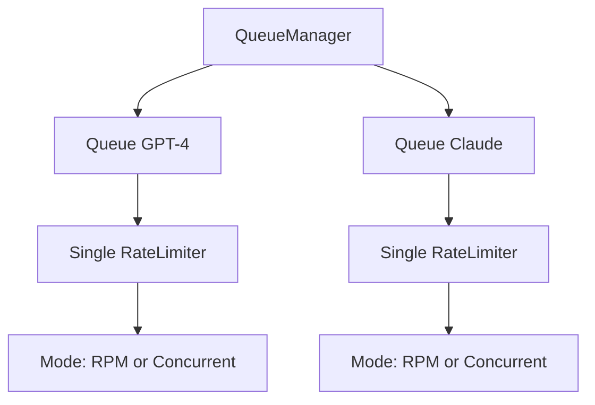
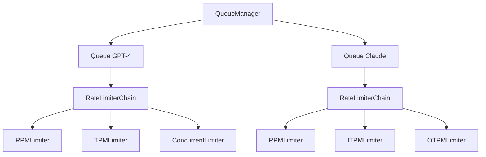
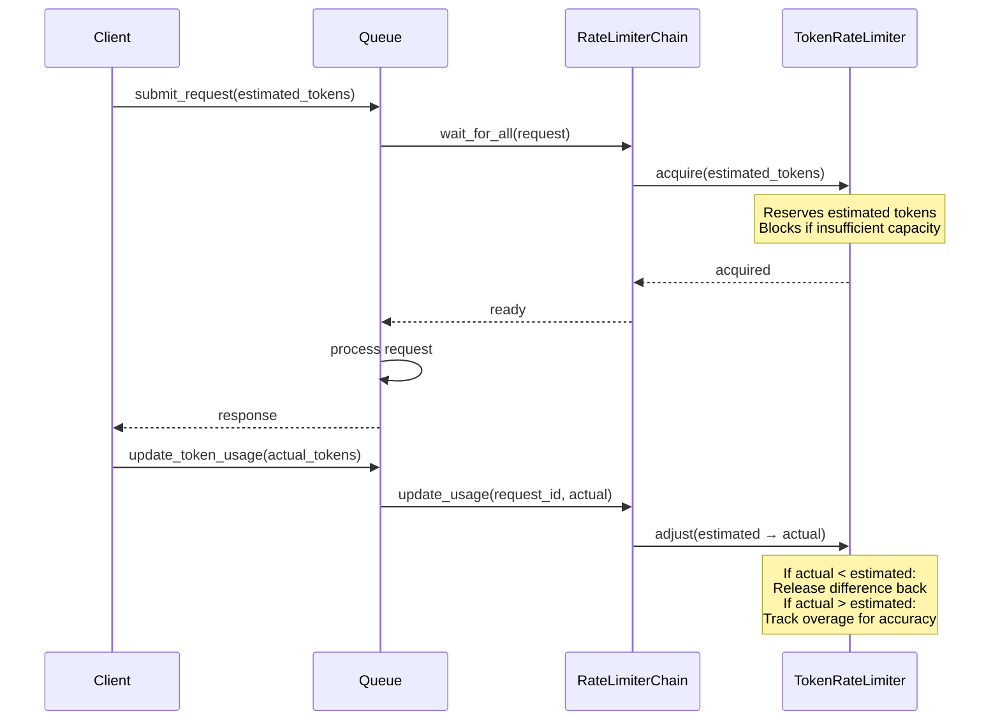

# V2 Multi-Rate Limiter Refactor Plan

## Overview

This document outlines the refactoring plan to upgrade `llm_queue` from a single rate limiter per model to supporting **multiple concurrent rate limiters** per model. This reflects real-world LLM provider constraints where models have various simultaneous limits.

## Current Architecture



**Limitations:**
- Each model only has ONE rate limiter
- Only supports `REQUESTS_PER_PERIOD` or `CONCURRENT_REQUESTS` modes
- No token-based rate limiting
- No support for multiple simultaneous limits (e.g., RPM + TPM + Concurrent)

## Target Architecture (V2)



**New Capabilities:**
- Multiple rate limiters per model
- Token-based rate limiting (TPM, TPD, ITPM, OTPM)
- Estimated vs actual token tracking
- Composable `RateLimiterChain` to manage multiple limiters

---

## Rate Limiter Types

| Type | Description | Period | Metric |
|------|-------------|--------|--------|
| **RPM** | Requests per Minute | 60s | Request count |
| **RPD** | Requests per Day | 86400s | Request count |
| **TPM** | Tokens per Minute | 60s | Total tokens (input + output) |
| **TPD** | Tokens per Day | 86400s | Total tokens (input + output) |
| **ITPM** | Input Tokens per Minute | 60s | Input tokens only |
| **OTPM** | Output Tokens per Minute | 60s | Output tokens only |
| **CONCURRENT** | Concurrent Requests | N/A | Active requests |

---

## Token Behavior

### Blocking Strategy

Token-based limiters (TPM, TPD, ITPM, OTPM) will **block requests** until sufficient capacity is available, just like request-based limiters. This ensures API calls don't fail due to rate limit issues from the provider.

```
Request Flow:
1. Request arrives with estimated_input_tokens=1000, estimated_output_tokens=500
2. RateLimiterChain checks all limiters (RPM, TPM, ITPM, OTPM, etc.)
3. If TPM limit exceeded → Request WAITS until capacity available
4. Once all limiters approve → Request proceeds to processor
5. After completion → update_token_usage() called with actual counts
```

### Token Tracking Lifecycle



### Key Behaviors

| Stage | Token Value Used | Purpose |
|-------|-----------------|---------|
| **Enqueue** | `estimated_input_tokens` + `estimated_output_tokens` | Reserve capacity, block if needed |
| **After Completion** | `actual_input_tokens` + `actual_output_tokens` | Adjust tracking for accuracy |

**Important**: The `update_token_usage()` call adjusts the limiter's internal tracking:
- If `actual < estimated`: Releases the difference back to available capacity
- If `actual > estimated`: Records the overage (doesn't block retroactively, but improves future accuracy)

---

## Design Principles

1. **Composability**: Rate limiters are composable and can be combined in any configuration
2. **Estimation Support**: Token-based limiters support estimated values for pre-check
3. **Actual Tracking**: After request completion, update with actual token usage
4. **Backward Compatibility**: V1 API should still work for simple cases
5. **Provider Presets**: Pre-configured rate limiter sets for common providers

---

## Proposed Changes

### Phase 1: Core Rate Limiter Types

#### [MODIFY] [models.py](file:///z:/code/llm_queue/src/llm_queue/models.py)

**Changes:**
1. Rename `RateLimiterMode` to `RateLimiterType` with expanded enum values:
   ```python
   class RateLimiterType(str, Enum):
       RPM = "rpm"                    # Requests per Minute
       RPD = "rpd"                    # Requests per Day
       TPM = "tpm"                    # Tokens per Minute
       TPD = "tpd"                    # Tokens per Day
       ITPM = "itpm"                  # Input Tokens per Minute
       OTPM = "otpm"                  # Output Tokens per Minute
       CONCURRENT = "concurrent"      # Concurrent Requests
   ```

2. Add `RateLimiterConfig` model:
   ```python
   class RateLimiterConfig(BaseModel):
       type: RateLimiterType
       limit: int
       time_period: Optional[int] = None  # Auto-set based on type
   ```

3. Update `ModelConfig` to accept multiple rate limiters:
   ```python
   class ModelConfig(BaseModel):
       model_id: str
       rate_limiters: List[RateLimiterConfig] = []
       # Deprecated fields for backward compatibility
       rate_limit: Optional[int] = None
       rate_limiter_mode: Optional[RateLimiterMode] = None
       time_period: Optional[int] = 60
   ```

4. Add token estimation fields to `QueueRequest`:
   ```python
   class QueueRequest(BaseModel, Generic[P]):
       # ... existing fields ...
       estimated_input_tokens: Optional[int] = None
       estimated_output_tokens: Optional[int] = None
       actual_input_tokens: Optional[int] = None
       actual_output_tokens: Optional[int] = None
   ```

5. Add token usage to `QueueResponse`:
   ```python
   class QueueResponse(BaseModel, Generic[T]):
       # ... existing fields ...
       input_tokens_used: Optional[int] = None
       output_tokens_used: Optional[int] = None
   ```

---

### Phase 2: Rate Limiter Refactoring

#### [MODIFY] [rate_limiter.py](file:///z:/code/llm_queue/src/llm_queue/rate_limiter.py)

**Changes:**
1. Create abstract base class `BaseRateLimiter`:
   ```python
   class BaseRateLimiter(ABC):
       @abstractmethod
       async def acquire(self, tokens: int = 0) -> bool: ...
       @abstractmethod
       async def release(self, tokens: int = 0) -> None: ...
       @abstractmethod
       async def wait_for_slot(self, tokens: int = 0) -> None: ...
       @abstractmethod
       def get_current_usage(self) -> int: ...
       @abstractmethod
       def get_available_capacity(self) -> int: ...
   ```

2. Create specialized rate limiters:
   - `RequestRateLimiter`: For RPM/RPD (count-based, time-window)
   - `TokenRateLimiter`: For TPM/TPD/ITPM/OTPM (token-based, time-window)
   - `ConcurrentRateLimiter`: For concurrent requests (semaphore-based)

3. Create `RateLimiterChain`:
   ```python
   class RateLimiterChain:
       """Manages multiple rate limiters for a single model."""
       def __init__(self, limiters: List[BaseRateLimiter]): ...
       async def acquire_all(self, request: QueueRequest) -> bool: ...
       async def release_all(self, request: QueueRequest) -> None: ...
       async def wait_for_all(self, request: QueueRequest) -> None: ...
       def update_token_usage(self, request_id: str, input_tokens: int, output_tokens: int) -> None: ...
   ```

#### [NEW] [rate_limiters/__init__.py](file:///z:/code/llm_queue/src/llm_queue/rate_limiters/__init__.py)

Create new module structure:
```
src/llm_queue/rate_limiters/
├── __init__.py
├── base.py              # BaseRateLimiter ABC
├── request_limiter.py   # RPM/RPD implementation
├── token_limiter.py     # TPM/TPD/ITPM/OTPM implementation
├── concurrent_limiter.py # Concurrent requests implementation
├── chain.py             # RateLimiterChain
└── factory.py           # Factory to create limiters from config
```

---

### Phase 3: Queue Integration

#### [MODIFY] [queue.py](file:///z:/code/llm_queue/src/llm_queue/queue.py)

**Changes:**
1. Replace single `RateLimiter` with `RateLimiterChain`
2. Pass request to chain for token-aware limiting
3. Support updating actual token usage after completion:
   ```python
   async def update_token_usage(self, request_id: str, input_tokens: int, output_tokens: int) -> None:
       """Update actual token usage for a completed request."""
   ```
4. Adjust `_process_queue` to work with chain's `acquire_all`/`release_all`

---

### Phase 4: Manager Updates

#### [MODIFY] [manager.py](file:///z:/code/llm_queue/src/llm_queue/manager.py)

**Changes:**
1. Update `register_queue` to handle new `ModelConfig` with multiple rate limiters
2. Add `update_token_usage` method for external reporting:
   ```python
   async def update_token_usage(
       self, model_id: str, request_id: str, 
       input_tokens: int, output_tokens: int
   ) -> None:
       """Report actual token usage for a completed request."""
   ```
3. Update `get_queue_info` to return info for all rate limiters
4. Maintain backward compatibility with legacy single-limiter config

---

### Phase 5: API Documentation

#### [NEW] [docs/api.md](file:///z:/code/llm_queue/docs/api.md)

Create comprehensive API documentation covering:
- Core Classes (`QueueManager`, `Queue`)
- Configuration Models (`ModelConfig`, `RateLimiterConfig`)
- Request/Response Models
- Rate Limiter Types

---

### Phase 6: Testing

#### [MODIFY] [test_rate_limiter.py](file:///z:/code/llm_queue/tests/test_rate_limiter.py)

- Add tests for each new rate limiter type
- Add tests for `RateLimiterChain`
- Add tests for token estimation vs actual usage

#### [NEW] [test_rate_limiter_chain.py](file:///z:/code/llm_queue/tests/test_rate_limiter_chain.py)

- Test multiple limiters working together
- Test token-based limiting with estimates
- Test actual token usage updates

#### [MODIFY] [test_queue.py](file:///z:/code/llm_queue/tests/test_queue.py)

- Update tests for new multi-limiter integration
- Add tests for `update_token_usage`

#### [MODIFY] [test_manager.py](file:///z:/code/llm_queue/tests/test_manager.py)

- Test new `ModelConfig` with multiple rate limiters
- Test backward compatibility with legacy config
- Test external token usage reporting

---

## Backward Compatibility

To maintain backward compatibility with V1 API:

```python
# V1 style (still works)
config = ModelConfig(
    model_id="gpt-4",
    rate_limit=10,
    rate_limiter_mode=RateLimiterMode.REQUESTS_PER_PERIOD,
    time_period=60
)

# V2 style (new)
config = ModelConfig(
    model_id="gpt-4",
    rate_limiters=[
        RateLimiterConfig(type=RateLimiterType.RPM, limit=60),
        RateLimiterConfig(type=RateLimiterType.TPM, limit=100000),
    ]
)
```

The `ModelConfig` will detect which style is used and convert V1 to V2 internally.

---

## Usage Examples

### Example 1: Claude with Multiple Limiters

```python
from llm_queue import QueueManager, ModelConfig, RateLimiterConfig, RateLimiterType, QueueRequest

manager = QueueManager()

# Configure Claude with multiple rate limiters
config = ModelConfig(
    model_id="claude-3-opus",
    rate_limiters=[
        RateLimiterConfig(type=RateLimiterType.RPM, limit=50),
        RateLimiterConfig(type=RateLimiterType.ITPM, limit=40000),
        RateLimiterConfig(type=RateLimiterType.OTPM, limit=8000),
    ]
)

await manager.register_queue(config, process_func)

# Submit request with token estimates
request = QueueRequest(
    model_id="claude-3-opus",
    params={"prompt": "Hello"},
    estimated_input_tokens=10,
    estimated_output_tokens=100,
)
response = await manager.submit_request(request)

# After processing, report actual usage
await manager.update_token_usage(
    model_id="claude-3-opus",
    request_id=request.id,
    input_tokens=8,
    output_tokens=95,
)
```

---

## Verification Plan

### Automated Tests

Run all tests with:
```bash
cd z:\code\llm_queue
pytest tests/ -v
```

Run specific test files:
```bash
# Test rate limiters
pytest tests/test_rate_limiter.py -v

# Test rate limiter chain (new)
pytest tests/test_rate_limiter_chain.py -v

# Test queue integration
pytest tests/test_queue.py -v

# Test manager
pytest tests/test_manager.py -v
```

### Manual Verification

1. **Backward Compatibility Test**: Create a script using V1 API and verify it still works
2. **Multi-Limiter Test**: Create a script with GPT-4 configuration (RPM + TPM) and verify both limits are enforced
3. **Token Usage Test**: Create a script that updates actual token usage and verify chain tracking

---

## Migration Notes

Existing users can migrate gradually:

1. **No changes required** for simple use cases - V1 API continues to work
2. **Opt-in** to multi-limiter by using new `rate_limiters` field
3. **Token tracking** is optional - only use if needed for your provider

---

## Timeline Estimate

| Phase | Description | Estimated Effort |
|-------|-------------|------------------|
| Phase 1 | Model updates | 2-3 hours |
| Phase 2 | Rate limiter refactoring | 4-6 hours |
| Phase 3 | Queue integration | 2-3 hours |
| Phase 4 | Manager updates | 1-2 hours |
| Phase 5 | API Documentation | 1-2 hours |
| Phase 6 | Testing | 3-4 hours |
| **Total** | | **13-20 hours** |
